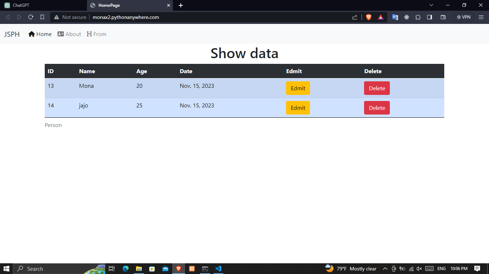
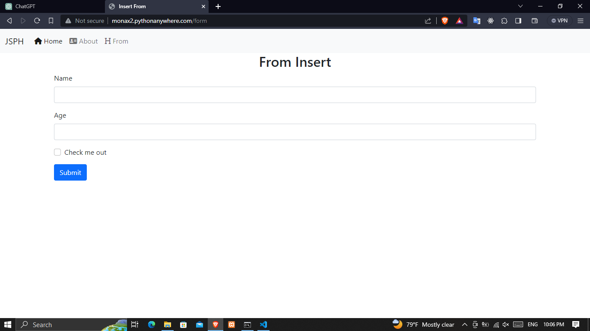

# Django Project Python

> - Insert Data sqlite 3
> - Select
> - Update
> - Delete
> - http://monax2.pythonanywhere.com/

<div>


<div>

# Install Python

> - Python https://www.python.org/

# Install Django

```bash
pip install Django
django-admin --version
django-admin startproject projectname
python manage.py runserver

```

# Run Web Django

```bash
python manage.py runserver
```

# Url

> - http://127.0.0.1:8000/

## select ter project

> - manage.py
>   ຄືຟາຍ script ສຳລັບລັນຳສັ່ງຕ່າງໆ ທີ່ກ່ຽວກັບ Django ເຊັນ Run Server, Model & Migration
> - **init**.py
>   ຄື initial ຟາຍ ຫຼຶ ຟາຍເປົ່າມີໄວ້ເກັບ Python Package ເຮົາສາມາດເພິ່ມ Script ການເຮັດວຽກເຂົ້າໄປໃນຟາຍນີ້ໄດ້
> - settings.py
>   ຄືຟາຍທີ່ໃຊ້ສຳຫຼັບການຕັ້ງຄ່າໂປຣເຈັກ ເຊັ່ນການຕັ້ງຄ່າ ແອັບ ,ເວລາ ,Path,ຖານຂໍ້ມູນ ເປັນຕົ້ນ
> - urls.py
>   ຄືຟາຍທີ່ໃຊ້ເກັບການ routin ຂອງ HTTP request ຫຼຶ ເອີ້ນອີກຢ່າງການກຳນົດ rulpattern ຂອງ django project
> - wsgi.py
>   ຄືຟາຍທີ່ໃຊ້ເກັບຂໍ້ມູນໂປຣເຈັກສຳຫຼັບການ Deployment

## MVT

> - Model (M) ຄື ສ່ວນທີ່ເກັບຂໍ້ມູນຂອງ Application
> - View (V) ຄື ສ່ອນປະມວ່ນຜົນຄຳສັ່ງຫຼຶຂໍ້ມູນຕ່າງ ໂດຍຄວບຄຸມການທຳງານລະຫວ່າງ Model ແລະ Template
> - Template (T) ຄື ໜ້າຕາ Application ເປັນສ່ວນທີ່ໄວ້ໃໃຊ້ສະແດງຜົນ ຂໍ້ມູນຜົນລັບຈາກາກນປະມວນຜົນຂໍ້ມູນໃນໜ້າເວັບຮ່ວມກັບ html

## Crate Application

> ໃນໂປຣແຈັກສາມາດແບ່ງອົງປະກອບອອກເປັນສ່ວນຍ່ອຍໆແລ້ວທຳມາທຳງານຮ່ວມກັນນພາຍຫຼັບໄດ້ ເອີ້ນວ່າ ແອັບ ເພືອຈັການກ່ຽວກັບລະບົບຍ່ອຍຕ່າງໆ ພາຍໃນໂປຣແຈັກຊຶ່ງພາຍຮ່ວມຂອງລະບົບສາມາແບ່ງການທຳງານອອກເປັນ 2 ລະດັບ ຄື
>
> - Project Level ຄືລະບົບຫຼັກ ສາມາດດຳເນີນການກັບໂປຮເຈັກໄດ້ໂດຍຕົງ
> - App Level ຄື ລະບົບຍ່ອຍເປັນການດຳເນີນການກັບລະບົບຍ່ອຍຕ່າງໆໃນໂປຣເຈັກ ເຊັ່ນ ລະບົບສະມາຊິກ, ລະບົບໜວດໝູ່ເປັນຕົ້ນ

```bash
 python manage.py startapp appname
```

## Add Application (ເພິ່ມແອັບລົງໃນໂປຣເຈັກ)

> - settings.py

```py
INSERTALLED_APPS = {
    'appname'
}
```

## URL & View

> - URL ສ່ວນທີ່ລະບຸເສັນທາງໃນການຮັບສົ່ງຂໍ້ມູນ
> - View ຄູນກາງສຳລັບຮັບສົ່ງຂໍ້ມູນໂດຍເຊືອມໂຍງການທຳງານລະຫວ່າງ Model ແລະ Template

### urls.py

```py
 form django.urls import path, include ຄືການນຳເອົາ url ມາໃຊ້ງານ
 urllpatterns ຄື ການກຳນົດກ່ມຮູບແບບຂອງpath (list)
```

### views.py

```py
form django.http import HttpResponse
def index(request):
    return HttpResponse("jay")
```

### Ex Code

> - url.py (project)

```py
from django.contrib import admin
from django.urls import path,include

urlpatterns = [
    path('admin/', admin.site.urls),
    path('',include("myapp.urls"))
]
```

> - views.py

```py
from django.shortcuts import render
from django.http import HttpResponse

# Create your views here.
def index(request):
    return HttpResponse("<h1>Jay</h1>")

def about(request):
    return HttpResponse("<h2>About</h2>")

def form(req):
    return HttpResponse("<h1>From Insert</h1>")

```

> - urls.py (app)

```py
from django.urls import path
from myapp import views
urlpatterns= [
    path('',views.index),
    path('about',views.about),
    path('form', views.form)
]
```

## Template (ໜ້າເວັບ)

> - ສ້າງໂຟເດີທີ່ຊື່ວ່າ templates ໃນແອັບພ້ອມຟາຍ html
> - ຊື່ແອັບ / views.py

```py
from django.shortcuts import render
def index(request):
    return render(request, "Naem Template.html")
```

## Django Template Language

> ຄືການແຊກໄວ້ຍາກອນພາສາ python ລົງໄປໃນເວັບ (html) ຊື່ມີທັງໝົດ 3 ຮູບແບບ
>
> - {{variable}} ຄືການແຊກົວປ່ຽນລົງໄປໃນສ່ວນທີ່ຕ້ອງການໃນໜ້າເວັບ
>
> -  ຄືການແຊກ tag ຫຼຶ ໂຄງສ້າງຄວບຄຸມລົງໄປໃນໜ້າເວັບ
> - {{variable | filter}} ຄື ການແຊກຕົວກອງຂໍ້ມູນໃນຕົວປ່ຽນ

> Ex

```html
<-- {{variable}} -->
<h1>Name : {{name}} Age : {{age}}</h1>
<--  --> 
<h3>Your 30++</h3>

<h4>Your 29--</h4>
 <-- {{variable | filter }} --> <-- upper ແປງເປັນຕົວພິມໃຫຍ່ --> <--
lower ແປງເປັນຕົວພິມນ້ອຍ --> <-- wordcount ນັບຈຳນວນຄຳ -->
<h1>Name : {{name | upper}} Age : {{age}}</h1>
```

### Beas Template

```html
 code 
```

### Model (M)

> ຄືສ່ວນທີ່ເກັບຂຂໍ້ມູນຂອງ Application ໂດຍຈະທຳໜ້າທີ່ ຈັດການຖານຂໍ້ມູນແທນການໃຊ້ຄຳສັ່ງ SQL ໂດຍຕົງ ຜ່ານການກຳໜົດ Class ແລະ Object ຊື່ເອີ້ນສ່ວນນີ້ວ່າ ORM (Object Relational Mapping)
>
> - Settings.py

```py
DATABASES = {
    "defalut": {
        'ENGINE':'django.db.backends.sqlilt3,
        'NAME' : os.path.join(BASE_DIR / 'db.sqlite3'),
    }
}
```

### create Model Sqllite3

> - models.py

```py
from django.db import models
class naemClass(models.Model):
```

### Django Field

```py
form django.db import models
class Person(models.Model) :
    name = models.CharField(max_length=50)
    age = models.IntegerField()
    date = models.DataField(auto_now_add=True)
```

### Migration

> - make migrations
> - migrate

```bash
python manage.py makemigrations
python manage.py migrate
```

### Admin Panel

> - create Admin Panel

```bash
python manage.py createsuperuser
```

### Register Model

> - admin.py

```admin.py
from django.contrib import admin
from <Appname>.models import <ModelName>
admin.site.register.<ModelName>
```

### Select Data Model

> - models.py

```py
class Person(models.Model) :
    name = models.CharField(max_length=100)
    age = models.IntegerField()
    date = models.DateField(auto_now_add=True)

    def __str__(self) :
        return "Name = " + self.name + ", Age = " + str(self.age)
```

### View Data

#### ດືງຂໍູ້ມນຫຼາຍລາຍການ (QuerySet)

> - all() - ດືງຂໍ້ມູນທັງໝົດ
> - filter(ເງືອນໄຂ) - ດືງຂໍ້ມູນພ້ອມລະບຸເງືອນໄຂ

#### ດືງຂໍ້ມູນລາຍການດຽວ (Single Object)

> - get(ເງືອນໄຂ) - ດືງຂຂໍ້ມູນພ້ອມລະບຸເງືອນໄຂ

```py
def index(request):
    all_person = Person.objects.filter(age=25)
    return render(request, "index.html", {"all_person": all_person})

```

> - index.html

```html
 
<title>HomePage</title>
 
<div class="table-responsive">
  <table class="table table-dark table-striped">
    <thead class="table-light">
      <caption>
        Person
      </caption>
      <tr>
        <th>ID</th>
        <th>Name</th>
        <th>Age</th>
        <th>Edmit</th>
        <th>Delete</th>
      </tr>
    </thead>
    <tbody>
      
      <tr class="table-primary">
        <td scope="row">{{person.id}}</td>
        <td>{{person.name}}</td>
        <td>{{person.age}}</td>
        <td><button class="btn btn-warning">Edmit</button></td>
        <td><button class="btn btn-danger">Delete</button></td>
      </tr>
      
    </tbody>
    <tfoot></tfoot>
  </table>
</div>


```

## From Insert Ddata

> - from

```html
<form method="get/post" action="path">
// code
</from>
```

> - request.method ຄຳສ່ັງສຳຫຼັບກວດສອບຮູບແບບການສົ່ງຂໍ້ມູນ
> - request.POST["name"] ຄຳສັ່ງຮັບຄ່າຈາກຂໍ້ມູນທີ່ສົ່ງມາໃຫ້ຮູບແບບ POST Mdethod

```py
def form(req):
    if req.method == "POST" :
        name = req.POST["name"]
        age = req.POST['age']
        print(name,age)
        return redirect("/")

    else :
        return render(req, "form.html")
```

### Insert Data From

> - form.html

```html
 
<title>Insert From</title>
 
<h2 class="text-center">From Insert</h2>
<form method="post" , action="/form">
  
  <div class="mb-3">
    <label for="exampleInputEmail1" class="form-label">Name</label>
    <input
      type="text"
      name="name"
      class="form-control"
      id="exampleInputEmail1"
      aria-describedby="emailHelp"
    />
  </div>
  <div class="mb-3">
    <label for="exampleInputPassword1" class="form-label">Age</label>
    <input
      type="number"
      name="age"
      class="form-control"
      id="exampleInputPassword1"
    />
  </div>
  <div class="mb-3 form-check">
    <input type="checkbox" class="form-check-input" id="exampleCheck1" />
    <label class="form-check-label" for="exampleCheck1">Check me out</label>
  </div>
  <button type="submit" class="btn btn-primary">Submit</button>
</form>

```

> - views.py

```py
def form(req):
    if req.method == "POST" :
        name = req.POST["name"]
        age = req.POST['age']

        person = Person.objects.create(
            name = name,
            age = age
        )
        person.save()
        return redirect("/")

    else :
        return render(req, "form.html")
```

### Message

- view.py

```py
from django.contrib import messages
def form(req):
        messages.success(req, "Insert Success")

```

- index.html

```html
 

<div class="alert alert-success" role="alert">
  <strong>{{message}}</strong>
</div>

```

### Edmit Data

- index.html

```html
<td><a href="edit/{{person.id}}" class="btn btn-warning">Edmit</a></td>
```

- urls.py

```py
    path('edit/<person_id>', views.edit)
```

- views.py

```py
def edit(request, person_id) :
    return render(request, 'edit.html')
```

### Select Data Edit

- views.py

```py
def edit(request, person_id) :
    person = Person.objects.get(id = person_id)
    return render(request, 'edit.html', {"person" : person})

```

- edit.html

```html
<input
  type="number"
  name="age"
  value="{{person.age}}"
  class="form-control"
  id="exampleInputPassword1"
/>
```

### UpDate Data

> - views.py

```py
def edit(request, person_id) :
    if request.method == "POST" :
        person = Person.objects.get(id = person_id)
        person.name = request.POST['name']
        person.age = request.POST['age']
        person.save()
        messages.success(request, "Update Success")
        return redirect('/')
    else :
        person = Person.objects.get(id = person_id)
        return render(request, 'edit.html', {"person" : person})

```

### Delete Data

> - urls.py

```py
    path('delete/<person_id>', views.delete)
```

> - index.html

```html
<a href="delete/{{person.id}}" class="btn btn-danger">Delete</a>
```

> - views.py

```py
def delete(request, person_id) :
    person = Person.objects.get(id = person_id)
    person.delete()
    messages.success(request, "Delete Success")
    return redirect('/')
```

### Delete Confirme

> - index.html

```html
<a
  onclick="return confirm('Delete Confirem Data {{person.name}} is now?')"
  href="delete/{{person.id}}"
  class="btn btn-danger"
  >Delete</a
>
```

### Deployment

> - pythonanywhere : https://www.pythonanywhere.com/

### Upload Project Django

> - ເຂົ້າຟາຍໃຫ້ເປັນ .zip
> - ເຂົ້າໄປໃນ ເວັບທີ່ pythonanywhere
> - ກົດ Upload a file ແລ້ວ ເລືອກ ໂປຣເຈັກ.zip
> - ກົດ Open Bash console here
> - ແຕກຟາຍ ໃນເວັບ pythonanywhere

```bash
unzip fileName.zip
```

> - ແກ້ໄຂ້ Source code: /home/monaX2/ProjectName

> - ແກ້ໄຂ WSGI configuration file ຈຸດທີ (project_home ແລະ os.environ['DJANGO_SETTINGS_MODULE'])

```py
# This file contains the WSGI configuration required to serve up your
# web application at http://monaX2.pythonanywhere.com/
# It works by setting the variable 'application' to a WSGI handler of some
# description.
#
# The below has been auto-generated for your Django project

import os
import sys

# add your project directory to the sys.path
project_home = '/home/monaX2/ProjectName'
if project_home not in sys.path:
    sys.path.insert(0, project_home)

# set environment variable to tell django where your settings.py is
os.environ['DJANGO_SETTINGS_MODULE'] = 'ProjectName.settings'


# serve django via WSGI
from django.core.wsgi import get_wsgi_application
application = get_wsgi_application()
```

### Error : DisallowedHost

> - Copy ໂດແມນ userName.pythonanywhere.com
> - ກົດໄປທີ່ Files
> - ແລ້ວເຂົ້າໄປ ໂປຮເຈັກ-> ເລືອກຫາ settings.py ຂອງໂປຮເຈັກ ແລ້ວ ແກ້ໄຂ້ຕາມນີ້

```py
# SECURITY WARNING: don't run with debug turned on in production!
DEBUG = False

ALLOWED_HOSTS = ["userName.pythonanywhere.com"]
```

> - http://monax2.pythonanywhere.com/ Upload Success
